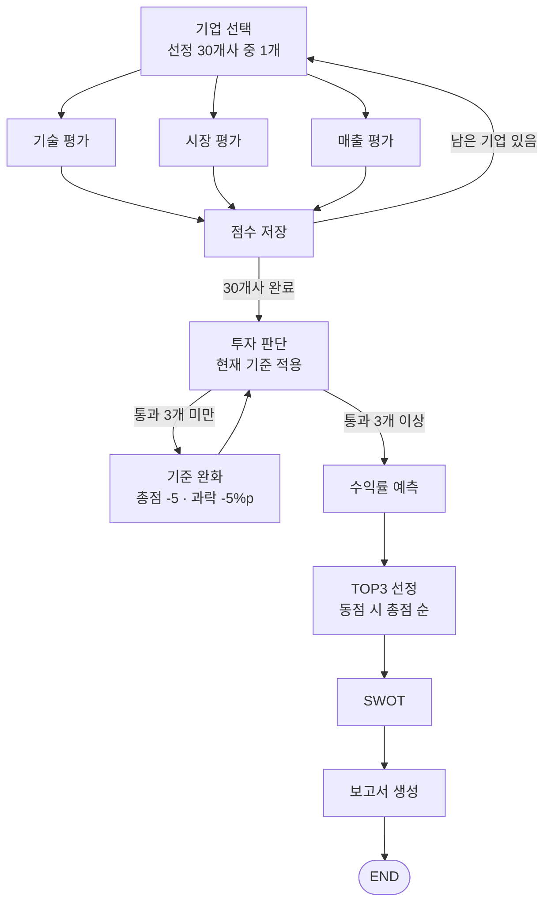

# AI Startup Investment Evaluation Agent — Semiconductor

본 프로젝트는 **반도체 AI 스타트업 30개사**의 투자 가능성을 평가하는 **LangGraph 기반 Multi-Agent + Agentic RAG** 시스템입니다. 기술·시장·매출을 병렬로 분석해 점수를 매기고, 투자 기준을 통과한 기업 중 **예상 수익률 TOP3**를 골라 투자 보고서를 생성합니다.

## Overview

- **Objective**: 반도체 스타트업의 기술력, 시장성, 매출을 기준으로 투자 적합성을 분석하고, 투자 추천 3곳과 예상 수익률을 담은 보고서를 생성
- **Method**: LangGraph 그래프 위에서 분석 에이전트(기술·시장·매출)를 병렬 실행하고, 조사 보고서 RAG와 뉴스 검색을 함께 사용
- **Tools**: Hybrid RAG (bge-m3 Dense + Sparse, FAISS), Google News RSS, Yahoo Finance(비교기업 지표)

## Features

- 선정 30개사를 한 회사씩 순회하며 기술(40) · 시장(40) · 매출(20) 점수를 병렬 산출
- 투자 기준(총점 60점 이상, 영역별 과락 40%)을 통과한 기업이 3개 미만이면 **기준을 자동 완화**(총점 -5점, 과락 -5%p)해 재판단
  - 재판단 시 분석을 다시 돌리지 않고 저장된 점수만 사용
- 통과 기업의 **예상 수익률**을 계산해 TOP3 선정 (동점이면 총점 순)
- TOP3 기업의 SWOT 분석 후 투자 보고서(SUMMARY ~ REFERENCE, 5장 이내) 생성
- 모든 점수에 근거 출처를 남기고, 예상 매출의 신뢰성(근거 확인 / 일부 확인 / 근거 없음)을 보고서에 표시
- REFERENCE는 에이전트가 실제로 근거로 쓴 자료만 코드에서 모아 작성 (조사 문서 섹션 → 그 섹션이 인용한 원자료, 뉴스는 언론사·날짜·제목 포함)

## Tech Stack

| Category   | Details |
|------------|---------|
| Framework  | LangGraph, LangChain, Python |
| LLM        | GPT-4.1-mini via OpenAI API |
| Retrieval  | FAISS (IndexFlatIP) + BGE-M3 learned sparse, RRF 결합, SQLite 메타데이터 |
| Embedding  | BAAI/bge-m3 (FlagEmbedding, 오픈소스·로컬 실행) |
| External   | Google News RSS, yfinance |

## Agents

| Agent | 역할 | RAG |
|---|---|---|
| 기술 평가 (`tech_agent`) | 핵심 기술·구현 가능성·검증·확장성·핵심 인력 평가 → 기술 40점 | O |
| 시장 평가 (`market_agent`) | 목표 시장 정의, 성장성·경쟁성·진입성 평가(실무가이드 부록 1), 시장 규모 수집 → 시장 40점 | O |
| 매출 평가 (`revenue_agent`) | 현재 매출·3개년 증가율·매출의 질 평가 → 매출 20점 | O |
| 투자 판단 (`investment_judge`, `forecast_returns`, `select_top`) | 기준 적용·완화, 예상 수익률 계산, TOP3 선정 | O (수익률 입력값) |
| SWOT (`swot_agent`) | TOP3 기업 강점·약점·기회·위협 분석 | O |
| 보고서 생성 (`report_agent`) | 투자 보고서 작성 | X |

## Architecture



> 과제 가이드의 "모두 보류 시 루프 종료 후 보고서 생성" 분기는, 추천 3곳을 반드시 도출하기 위해 **기준 완화 루프**로 대체했습니다. 적용된 최종 기준과 완화 횟수는 보고서에 고지합니다.

## Evaluation Criteria

| 영역 | 배점 | 세부 항목 |
|---|---|---|
| 기술 | 40 | 핵심 기술 차별성 14 · 구현 가능성 14 · 검증 4 · 확장성 4 · 핵심 인력 4 (O/X) |
| 시장 | 40 | 성장성 20 · 경쟁성 10 · 진입성 10 (기술가치평가 실무가이드 부록 1 등급 기준) |
| 매출 | 20 | 현재 매출 10 · 매출 증가율 5 · 매출의 질 5 |

- 등급 판정은 5점 척도(a~e, 0.5 단위)를 배점에 비례 환산
- 평가 자료가 있으면 최소 1점, 자료가 없으면 0점

### 예상 수익률

| 단계 | 계산 |
|---|---|
| 예상 매출 (n년 후) | 목표 시장 규모 × 목표 점유율 (없으면 목표 매출액, 목표 연도가 이르면 시장 성장률로 보정) |
| Exit 기업가치 | 예상 매출 × 비교기업 순이익률 중간값 × 비교기업 PER 중간값 |
| 지분율 | 투자 금액 ÷ (현재 기업가치 + 투자 금액) |
| 현재가치 | Exit 기업가치 × 지분율 ÷ 1.2ⁿ |
| 수익률 | (현재가치 − 투자 금액) ÷ 투자 금액 |

- 비교기업: 상장 반도체 설계·IP 기업 중 시가총액 $100B 이상 제외, 흑자 기업만
- 현재 기업가치: 공개 기업가치 → 없으면 최근 라운드 금액 ÷ Carta 라운드별 중간 희석률
- 할인율 20%: 기술가치평가 실무가이드의 비상장 기업 자기자본비용 통상 범위(10~25%) 기준

자세한 결정 근거는 [docs/구현_결정사항.md](docs/구현_결정사항.md)를 참고하세요.

## RAG Data

- **문서**: [docs/AI반도체_스타트업_30사_기업평가_자료.md](docs/AI반도체_스타트업_30사_기업평가_자료.md) (30개사 기술·재무·투자 조사 보고서, 200페이지 한도 내)
- **임베딩 저장소**: `rag_store/` — bge-m3 Dense·Sparse 벡터 923개, FAISS 인덱스, SQLite 메타데이터 ([상세](rag_store/EMBEDDING_README.md))

## Directory Structure

```
├── main.py              # 실행 진입점
├── graph.py             # LangGraph 그래프 구성
├── agents.py            # 에이전트(노드) 정의
├── state.py             # State · 구조화 출력 스키마
├── rag.py               # 하이브리드 검색 래퍼
├── tools.py             # 뉴스 검색 · 비교기업 지표
├── config.py            # 평가 기준 · 대상 기업 설정
├── rag_store/           # bge-m3 임베딩 · FAISS · SQLite
├── docs/                # 조사 보고서 · 구현 결정사항
└── outputs/             # 생성된 보고서 (실행 시 생성)
```

## Getting Started

```bash
pip install -r requirements.txt
cp .env.example .env      # OPENAI_API_KEY 입력
python main.py --draw     # 그래프 구조 확인
python main.py --limit 3  # 3개사로 빠르게 점검
python main.py --amount 1000000000 --years 5   # 30개사 전체 실행
```

- 첫 실행 시 bge-m3 모델(약 2.2GB)을 내려받습니다.
- 결과: `outputs/investment_report_YYYY-MM-DD.md`, `outputs/evaluations.json`

## Contributors

| 이름 | 역할 |
|---|---|
| 김해린 | 시장 평가 에이전트 (`market_agent`) |
| 이은주 | 기술 평가 에이전트 (`tech_agent`) |
| 박준형 | RAG 파이프라인 (bge-m3 임베딩, FAISS 하이브리드 검색, `rag_store/`, `rag.py`) |
| 이성환 | 투자 판단 에이전트 (`investment_judge`, 기준 완화 루프 `relax_criteria`) |
| 유희범 | 매출 평가 에이전트 (`revenue_agent`), 수익률 예측 (`forecast_returns`, `select_top`) |
| 공통 | SWOT 분석 (`swot_agent`), 투자 보고서 생성 (`report_agent`), LangGraph 그래프 구성 (`graph.py`, `main.py`) |
