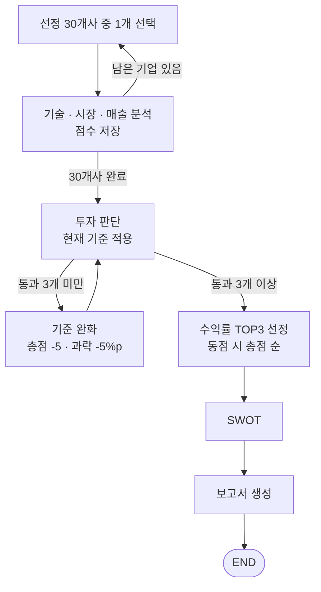

# 구현 결정사항 (설계서 보완)

> 설계서(노션)에서 비어 있거나 서로 어긋난 부분을 구현 전에 확정한 내용.
> ✅ = 팀 결정, 🤖 = 팀 위임으로 Claude가 결정 (근거 표시)

---

## 1. 그래프 흐름 ✅

1. 선정 30개사를 한 회사씩 분석한다: 기술 · 시장 · 매출 → 점수 저장
2. 30개사 분석이 끝나면 투자 판단을 한다.
3. 통과 기업이 3개 미만이면 기준을 완화하고 다시 판단한다. 분석 에이전트는 다시 돌리지 않고, 저장된 점수에 새 기준만 적용한다.
4. 통과 기업 중 수익률 TOP3를 뽑고 → SWOT → 보고서를 생성한다.

- 설계서 다이어그램 입력 단계의 "기업 리스트 생성(외부 API·크롤링)"은 제거한다. 30개사는 고정 목록이다. 🤖
- 과제 안내의 "모두 보류 시 루프 종료 후 보고서" 분기는 기준 완화 루프로 대체하고, README에 설계 선택으로 명시한다. 🤖

## 2. 투자 판단 기준 ✅

| 항목 | 규칙 |
|---|---|
| 시작 기준 | 총점 60점 이상 + 기술·시장·매출 각 배점의 40% 이상 (과락) |
| 완화 조건 | 통과 기업 3개 미만 |
| 완화 폭 | 총점 -5점, 과락 -5%p (과락은 0%에서 멈춤) |
| 최저 한도 | 없음. 3개 이상 통과할 때까지 반복 (최대 12회) |
| 최종 선정 | 통과 기업 중 수익률 TOP3, 동점이면 총점 높은 순 |
| 보고서 고지 | 최종 적용 기준(총점·과락)과 완화 횟수 명시 |

## 3. 점수 체계 🤖

- 각 분석 에이전트는 **배점 그대로** 점수를 출력한다: 기술 0~40, 시장 0~40, 매출 0~20. 설계서 다이어그램의 "0~100"은 쓰지 않는다.
- **시장 합산은 40점**이다 (성장성 20 + 경쟁성 10 + 진입성 10). 설계서의 "20점 만점으로 합산"은 오기로 본다.
- **시장 규모는 채점하지 않지만 수집한다.** 과제 보고서 필수 내용에 "시장 규모"가 있고, 수익률 계산(예상 매출)에도 필요하다.
- **채점 방식**
  - 기술 지표 4개와 시장 3항목은 5단계 등급(ⓐ~ⓔ)으로 판정한다.
  - 등급 점수(0.5~5)를 배점에 비례해 환산한다. 예: 배점 14 → 등급 점수 × 2.8
  - 시장 판정 기준은 실무가이드 부록 1을 쓴다.
  - 기술 지표도 같은 5단계 형식의 판정 문장을 프롬프트에 넣는다.
- **핵심 인력 (4점)**: 핵심 인물이 있으면 4점, 없으면 0점 (O/X)
- **지침**: 평가할 자료가 있으면 조건을 못 채워도 최소 1점, 자료가 없으면 0점 (설계서 지침 그대로)

### 매출 평가 세부 구간 🤖

| 항목 (배점) | 구간 → 점수 |
|---|---|
| 현재 매출 (10) | 100억 원 이상 10 / 30억~100억 7 / 10억~30억 5 / 1억~10억 3 / 1억 미만 1 / 자료 없음 0 |
| 매출 증가율 (5) | 3개년 연평균 100% 이상 5 / 50~100% 4 / 0~50% 3 / 감소 1 / 자료 없음 0 |
| 매출의 질 (5) | 목표 사업 제품 매출 5 / 제품+용역 혼재 3 / 용역·과제 위주 1 / 자료 없음 0 |

- 달러 매출은 평가 시점 환율로 원화 환산한다.
- 근거: 30사 자료집의 2025 매출 분포 (0.45억~320억)

## 4. 수익률 계산 ✅ / 🤖

| 단계 | 계산 | 결정 |
|---|---|---|
| ① 예상 매출 (n년 후) | 목표 시장 규모(n년 후) × 목표 점유율. 없으면 목표 매출액, 그것도 없으면 가장 유사한 지표 | ✅ |
| ①-1 목표 연도 보정 | 목표 연도가 n년보다 이르면 시장 성장률로 n년까지 확장 | 🤖 |
| ② 신뢰성 표시 | 뉴스·산업 리포트로 근거 확인 → 보고서에 "근거 확인 / 일부 확인 / 근거 없음" 표시만 | ✅ |
| ③ 예상 순이익 | ① × 비교기업 순이익률 중간값 | 🤖 |
| ④ Exit 기업가치 | ③ × 비교기업 PER 중간값 | ✅ (PER), 🤖 (비교군) |
| ⑤ 지분율 | 투자 금액 ÷ (현재 기업가치 + 투자 금액) | |
| ⑥ Exit 회수 금액 | ④ × ⑤ | |
| ⑦ 현재가치 | ⑥ ÷ 1.2ⁿ (할인율 20%) | ✅ |
| ⑧ 수익률 | (⑦ − 투자 금액) ÷ 투자 금액 | ✅ |

- n = 사용자가 입력한 투자 유지 기간

**비교기업 그룹** (③·④) 🤖
- 상장 반도체 설계·IP 기업 중 **시가총액 $100B 이상 대기업은 제외**
- **흑자 기업만** 넣어 순이익률·PER 중간값을 구한다 (적자 기업은 PER 계산 불가).
- 근거: Damodaran 미국 반도체 업종(2026.1)은 적자 기업이 62%인데 합산 순이익률이 30.45%다. 초대형 기업이 평균을 끌어올린다. ([출처](https://pages.stern.nyu.edu/~adamodar/New_Home_Page/datafile/margin.html))

**현재 기업가치 추정 순서** (⑤) 🤖
1. 공개된 기업가치
2. 최근 라운드 금액 ÷ 라운드별 중간 희석률 (Carta 2025: Seed 19.5%, A 18%, B 14%, C 10%, D 7.5% — [출처](https://carta.com/data/linkedin-dilution-by-venture-round-medians/))
3. 둘 다 없으면 수익률 계산에서 제외하고 보고서에 표시

- 초기 자본(자본금)은 쓰지 않는다. 자본금은 액면가 합계라 기업가치와 관계가 없다. 예: 딥엑스 자본금 4.1억 원 vs 보도 기업가치 약 2.65조 원. 지분율이 약 1,900배 부풀려진다.

**할인율 20% 근거**: 기술가치평가 실무가이드(산업통상자원부, 2014) — 비상장 기업가치평가 자기자본비용 통상 10~25%

## 5. RAG 🤖

- **매출 평가 에이전트 → RAG O로 변경**. DART 원문 매출이 30사 자료집(RAG 문서)에 있다.
- **검색 방식**
  - bge-m3의 Dense + Sparse 하이브리드 검색으로 한다.
  - FAISS는 Dense만 지원하므로, bge-m3의 sparse(lexical weight) 점수를 별도 계산해 합산한다.
  - 임베딩 모델이 오기 전에는 BM25로 대체한다.
- **임베딩 교체**: 임베딩은 인터페이스로 분리해, 팀원이 모델을 주면 교체만 한다.
- **시장 에이전트 자료**: 뉴스(구글 RSS)와 웹 검색으로 수집한다. 200페이지 한도 안에서 산업 리포트를 추가하면 RAG에도 넣는다.

## 6. 보고서 🤖

과제 요구사항 반영:
- 맨 앞 **SUMMARY** (1/2페이지 이내), 맨 뒤 **REFERENCE**
- 필수 내용: 사업 아이디어, 사업 리스크, **시장 규모**, 팀 구성, **한계점**
- 5장 이내

1. SUMMARY: 추천 3곳, 투자 금액, 예측 수익률
2. 평가 기준 및 고지: 적용 기준, 완화 횟수, 수익률 가정, 신뢰성 표시
3. 기업별 분석 (추천 3곳): 사업 아이디어·팀, 기술·시장(규모 포함) 분석, 재무 요약, 평가 점수·수익률, SWOT·리스크
4. 한계점
5. REFERENCE

## 7. 보안
- OpenAI API 키가 노션과 설계서 zip에 노출되어 있다. 폐기 후 재발급하고, 코드에서는 `.env`로만 불러온다. `.env`는 `.gitignore`에 넣는다.
